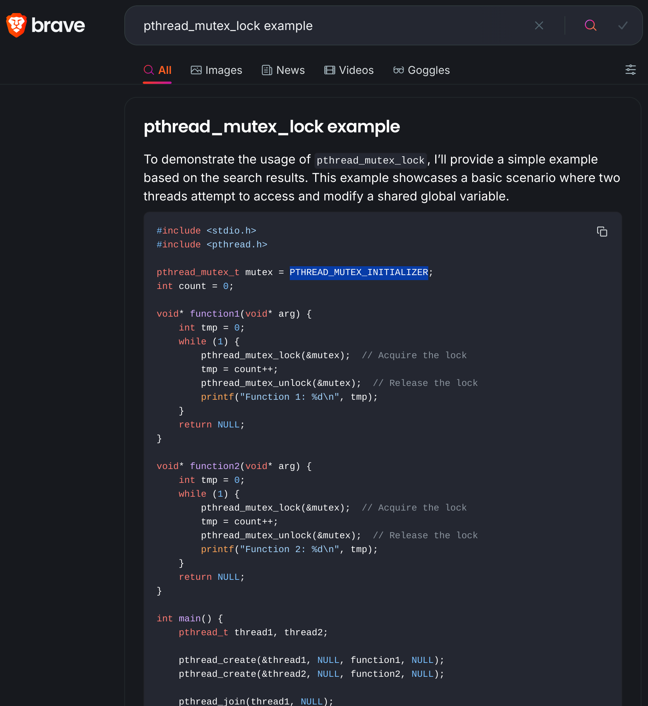

- The manual/docs for C libraries are not often beginner-friendly. I'd recommend googling with "example" keyword, or using AI.
    

- `sem_post()` and `sem_wait()`:
    sem_post:

    Increments the value of a semaphore by 1.
    If there are waiting threads (semaphores have a value of 0), it wakes up one of them, allowing it to proceed.
    If there are no waiting threads, sem_post does nothing.
    sem_wait:

    Decrements the value of a semaphore by 1.
    If the semaphore’s value is initially 0, the calling thread will block until another thread calls sem_post to increment the value and wake up the waiting thread.
    If the semaphore’s value is initially positive, sem_wait will decrement it and allow the calling thread to proceed.
    In summary, sem_post releases a semaphore, potentially waking up waiting threads, while sem_wait acquires a semaphore, potentially blocking if it’s already at 0.

    Regarding the question about calling sem_post before sem_wait, the answer is that it will work as expected. sem_post simply increments the semaphore, and if there are waiting threads, it will wake them up. The order of calls does not matter, as long as the semaphore’s value is properly managed.